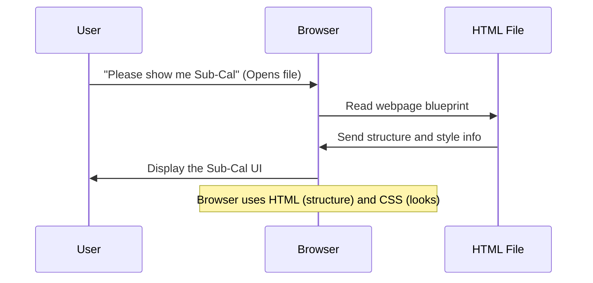

# Chapter 1: Web User Interface (UI)

Welcome to the **Sub-Cal** project! In this journey, we'll explore how this tool helps you understand and calculate network subnets. Every journey starts with a first step, and for any computer program you use, that first step often involves its **User Interface**.

### What is a Web User Interface (UI)?

Think of a calculator. It has buttons you press, and a screen where you see the numbers and answers. The buttons and the screen together form the calculator's **User Interface**.

Similarly, when you visit a website, the **Web User Interface (UI)** is everything you *see* and *interact with* on the screen. It's the "dashboard" that lets you put in information and clearly see the results. For our **Sub-Cal** project, the UI is the entire webpage with its input boxes, buttons, and all the places where the calculation results are shown.

### Why is the UI Important?

Imagine you need to figure out how to divide a large network into smaller parts (this is called "subnetting"). This can involve complex calculations! Without a good UI, you'd have to do all the math by hand, which is tedious and prone to errors.

The `Sub-Cal` UI solves this problem by providing a friendly way to:
1.  **Input:** Tell the calculator what IP address and how many "hosts" (devices) you need.
2.  **Trigger:** Click a button to start the calculation.
3.  **Output:** See all the complex results neatly organized on the screen.

Let's look at how you would use `Sub-Cal` with its UI.

### Our First Use Case: Getting Subnet Details

Let's say you have an IP address `192.168.1.0` and you need to create a subnet that can hold `30` host devices. How would you use `Sub-Cal` to get the answers?

1.  **Open the Sub-Cal webpage:** This loads the UI into your web browser.
2.  **Find the "IP Address" box:** You'll type `192.168.1.0` into this box.
3.  **Find the "Hosts per Subnet" box:** You'll type `30` into this box.
4.  **Click the "Calculate Subnet" button:** This tells `Sub-Cal` to perform its magic!
5.  **View the Results:** The UI will then display a lot of information, like the new subnet mask, network ranges, and more, all neatly laid out.

#### UI Elements for Input

Let's see the specific parts of the `Sub-Cal` UI that allow you to put in information.

Here’s a simplified look at the HTML code that creates the "IP Address" input box:

```html
<!-- Input field for IP Address -->
<div>
    <label for="ipAddress" class="block text-sm font-medium text-gray-700 mb-1">IP Address</label>
    <input type="text" id="ipAddress" placeholder="e.g. 192.168.1.0"
        class="w-full px-4 py-2 border border-gray-300 rounded-md focus:ring-2 focus:ring-indigo-500 focus:border-indigo-500"
        required>
</div>
```
This HTML code creates a label "IP Address" and an input box (`<input>`) where you can type. The `id="ipAddress"` is like a unique name for this box, allowing the program to find what you've typed.

Next, you need to tell it how many hosts:

```html
<!-- Input field for Hosts per Subnet -->
<div>
    <label for="hosts" class="block text-sm font-medium text-gray-700 mb-1">Hosts per Subnet</label>
    <input type="number" id="hosts" placeholder="e.g. 30" min="2"
        class="w-full px-4 py-2 border border-gray-300 rounded-md focus:ring-2 focus:ring-indigo-500 focus:border-indigo-500"
        required>
</div>
```
Similar to the IP address, this HTML creates an input box, but this one is specifically for numbers (`type="number"`).

Finally, after you've entered the information, you need to tell `Sub-Cal` to start the calculation. This is done with a button:

```html
<!-- The "Calculate" button -->
<button type="submit"
    class="w-full bg-indigo-600 text-white py-2 px-4 rounded-md hover:bg-indigo-700 focus:outline-none focus:ring-2 focus:ring-indigo-500 focus:ring-offset-2 transition-colors duration-200 flex items-center justify-center">
    <i class="fas fa-calculator mr-2"></i> Calculate Subnet
</button>
```
This HTML creates the "Calculate Subnet" button. When you click it, the calculation process begins (which we'll cover in the next chapter!).

#### UI Elements for Displaying Results

After clicking "Calculate", `Sub-Cal`'s UI will show you the answers. These are organized into different sections:

1.  **Summary Cards:** Quick overview of the results, like the Network Class and new Subnet Mask.
2.  **Detailed Information:** More specific numbers, like how many host bits are needed.
3.  **Network Ranges Table:** A table listing the network address, broadcast address, and usable IP range for multiple subnets.

Here's a small part of the HTML for a "Summary Card":

```html
<!-- One of the summary cards -->
<div class="bg-white rounded-lg p-4 result-card">
    <h3 class="font-semibold text-gray-700 mb-2 flex items-center">
        <i class="fas fa-network-wired text-indigo-500 mr-2"></i> Network Class
    </h3>
    <div class="flex justify-between items-center">
        <span class="text-gray-600">Class</span>
        <span id="networkClass" class="font-bold text-indigo-600"></span>
    </div>
</div>
```
This code creates a box (`div`) that displays the "Network Class" result. The actual value will appear inside the `span` element with `id="networkClass"`.

And here's a peek at the table structure for "Network Ranges":

```html
<!-- Part of the Network Ranges table -->
<div class="overflow-x-auto">
    <table class="min-w-full divide-y divide-gray-200">
        <thead>
            <tr>
                <th>Subnet</th>
                <th>Network Address</th>
                <th>Broadcast Address</th>
                <th>Usable Range</th>
            </tr>
        </thead>
        <tbody id="networkRanges">
            <!-- Results for each network range go here -->
        </tbody>
    </table>
</div>
```
This HTML creates the basic structure of a table with headings for "Subnet", "Network Address", etc. The actual calculated ranges will be added into the `<tbody>` (table body) section by the program.

### How the UI is Built (Under the Hood)

The UI for `Sub-Cal` is built using standard web technologies:

*   **HTML (HyperText Markup Language):** This is the "bones" of the webpage. It defines all the elements you see: headings, paragraphs, input boxes, buttons, tables, etc. It's like the blueprint of a house, showing where each room and feature goes.
*   **CSS (Cascading Style Sheets):** This is the "skin" or "decoration" of the webpage. It tells the browser how everything should look: colors, fonts, spacing, rounded corners, shadows, and how elements should be arranged. `Sub-Cal` uses a tool called **Tailwind CSS** to make styling easier and faster.
*   **JavaScript:** While the next chapter will dive deeper into this, JavaScript is the "brain" that makes the UI *interactive*. It responds when you type in boxes or click buttons, and it updates the results on the screen.

When you open `light-sub-cal.html` (or `index.html`), your web browser acts like a construction worker. It reads the HTML blueprint, then applies the CSS decorations, to build the webpage you see.

Let's visualize this simple process:



As you can see, the UI is essentially the visual layer that allows a human user to interact with the underlying calculations without needing to understand the complex code behind it. It provides a straightforward "dashboard" for getting the job done.

### Conclusion

In this chapter, you learned that the **Web User Interface (UI)** is the visual part of `Sub-Cal` that you interact with. It includes the input fields for IP addresses and hosts, the "Calculate" button, and all the result display areas like summary cards and tables. We explored how HTML defines these elements and how CSS makes them look good.

In the next chapter, we'll dive into how these UI elements actually *do* something when you interact with them. We'll explore the **[Client-Side Interaction & Display Logic](02_client_side_interaction___display_logic_.md)**, which is where JavaScript comes into play!

---
