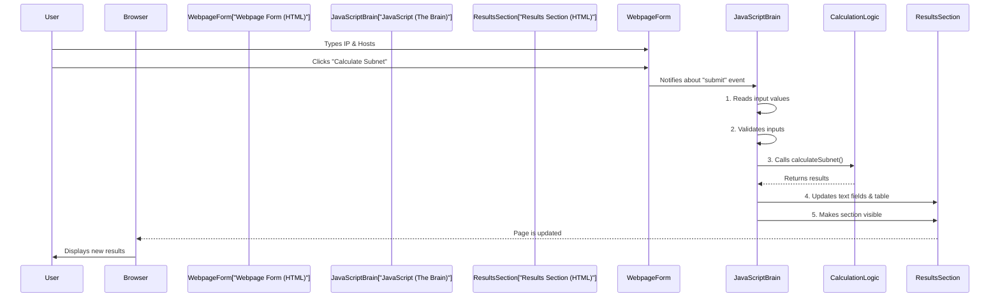

# Chapter 2: Client-Side Interaction & Display Logic

Welcome back to the **Sub-Cal** project! In the [previous chapter](01_web_user_interface__ui__.md), we looked at the `Sub-Cal`'s **Web User Interface (UI)**. We learned that the UI is like the calculator's buttons and screen – it's what you see and interact with. But what happens when you *press* a button or *type* something? How does the calculator actually *do* its work and show you new results?

### Making the Webpage "Come Alive"

Imagine you have a toy car. The body (UI) looks great, but without an engine or controls, it won't move. The **Client-Side Interaction & Display Logic** is like the engine and control panel for `Sub-Cal`. It's the "brain" that lives *inside your web browser* and makes the webpage react to what you do.

This part of `Sub-Cal` is responsible for:
*   **Reacting to your clicks and typing:** When you hit "Calculate", it notices!
*   **Checking your inputs:** Is the IP address correct? Are there enough hosts?
*   **Running the calculations:** It kicks off the complex math for subnetting.
*   **Showing the results:** It takes the answers and smartly updates the webpage.
*   **Extra helpful tools:** Like allowing you to easily copy results to your clipboard.

It's the part that transforms a static (still) webpage into a dynamic (moving, responsive) application!

### Our Use Case: Calculating and Displaying Subnets

Let's revisit our example from Chapter 1: You want to subnet `192.168.1.0` for `30` host devices. You've typed these into the input boxes.

What happens next is where **Client-Side Interaction & Display Logic** takes over:

1.  You **click** the "Calculate Subnet" button.
2.  The program **validates** your input (checks if `192.168.1.0` is a real IP and `30` is a valid number of hosts).
3.  If everything is good, it **triggers** the powerful subnet calculation process (which we'll explore in future chapters like [IP Class Determination](03_ip_class_determination_.md) and [Host & Subnet Bit Calculation](04_host___subnet_bit_calculation_.md)).
4.  Once the calculations are done, it **dynamically updates** the results section of the webpage, filling in all the empty spaces we saw in Chapter 1 with actual numbers and addresses.
5.  Finally, it gives you "copy" buttons so you can **easily extract** the calculated data.

This whole sequence of events is managed by this "logic" on the "client-side" (meaning, your web browser).

### How It Works: The "Brain" of the Webpage

The "magic" behind client-side interaction and display is primarily done using **JavaScript**. Think of JavaScript as the web's programming language that makes things happen *in your browser*.

Here are the key steps involved:

1.  **Listening for Events:**
    The webpage constantly "listens" for things you do, like clicking a button or typing in a box. When something happens, it's called an "event."
2.  **Getting Information:**
    When an event occurs (like clicking "Calculate"), the JavaScript code quickly grabs the information you've typed into the input boxes (e.g., the IP address and hosts per subnet).
3.  **Validation (Checking Inputs):**
    Before doing any heavy work, `Sub-Cal` checks if your inputs make sense. For example, is the IP address in a valid format? Is the number of hosts at least 2 (because you need at least 2 addresses for a network and a broadcast)? If not, it will show you a friendly message.
4.  **Calling Calculation Functions:**
    Once inputs are validated, the JavaScript then calls other specialized parts of `Sub-Cal` to perform the actual subnetting math. We'll dive into these "calculation functions" in later chapters.
5.  **Displaying Results:**
    After the calculations are complete, the JavaScript receives all the answers. It then finds the specific places in the UI (those empty `<span>` tags or table `<tbody>` from Chapter 1) and fills them in with the new, calculated data. It also makes the "Results" section visible, as it's initially hidden.
6.  **Copy to Clipboard:**
    For convenience, JavaScript also handles the "copy to clipboard" feature. When you click a copy button, it quickly copies the text to your computer's clipboard, ready for you to paste elsewhere.

Let's visualize this process when you click the "Calculate Subnet" button:


*Note: `CalculationLogic` is a conceptual block here. Its specific functions are covered in [Chapter 3: IP Class Determination](03_ip_class_determination_.md) and beyond.*

### Under the Hood: A Look at the JavaScript Code

All of this client-side magic happens within the `<script>` tags at the bottom of the `light-sub-cal.html` (or `index.html`) file. Let's look at some simplified parts of the JavaScript code.

#### 1. Listening for the "Calculate" Button Click

First, the code waits for the entire webpage to load, then it finds the form and sets up a "listener" for when you submit it.

```javascript
// File: light-sub-cal.html (or index.html)
document.addEventListener('DOMContentLoaded', function () {
    const form = document.getElementById('subnetForm'); // Find the form by its ID

    // Listen for when the form is submitted (e.g., button clicked)
    form.addEventListener('submit', function (e) {
        e.preventDefault(); // Stop the page from reloading
        
        // Get values from input boxes
        const ipAddress = document.getElementById('ipAddress').value;
        const hosts = parseInt(document.getElementById('hosts').value);

        // ... more steps like validation and calculation ...
    });
});
```
*   `document.addEventListener('DOMContentLoaded', ...)`: This line makes sure our JavaScript code only runs *after* the entire webpage is ready.
*   `getElementById('subnetForm')`: This finds the specific `<form>` element in the HTML that has the unique `id="subnetForm"`.
*   `form.addEventListener('submit', ...)`: This is the "listener." It waits for the `submit` event on our form.
*   `e.preventDefault()`: Forms usually try to reload the page when submitted. This line stops that, so our JavaScript can handle everything smoothly without a refresh.
*   `.value`: This is how we get the text or number you typed into an input box.

#### 2. Validating Inputs

It's crucial to check if the user's input is valid. `Sub-Cal` has a simple function for this.

```javascript
// File: light-sub-cal.html (or index.html)
function validateIP(ip) {
    // A complex pattern to check if the IP looks correct
    const ipPattern = /^((25[0-5]|...){3}(25[0-5]|...)$/; 
    return ipPattern.test(ip); // Returns true if IP matches pattern
}

// Inside the submit event listener:
if (!validateIP(ipAddress)) { // If IP is NOT valid
    alert('Please enter a valid IP address'); // Show a message
    return; // Stop here
}

if (hosts < 2) { // If hosts is less than 2
    alert('Hosts per subnet must be at least 2'); // Show another message
    return; // Stop here
}
```
*   `validateIP(ip)`: This is a function that takes the IP address as text and checks if it follows the rules for an IP address.
*   `alert(...)`: This pops up a small message box on the screen to tell the user if something is wrong.
*   `return`: This stops the rest of the code from running if there's an error, preventing `Sub-Cal` from trying to calculate with bad data.

#### 3. Displaying Results Dynamically

Once the calculations are done (by functions like `calculateSubnet` that we'll explore in depth in later chapters), the `displayResults` function is called to update the UI.

```javascript
// File: light-sub-cal.html (or index.html)
function displayResults(data) {
    // Update the Network Class text
    document.getElementById('networkClass').textContent = data.class;
    // Update the New Mask text
    document.getElementById('newMask').textContent = `${data.newMask}`;

    // Make the entire results section visible
    document.getElementById('results').classList.remove('hidden');

    // Prepare the table for network ranges (simplified)
    const tableBody = document.getElementById('networkRanges');
    tableBody.innerHTML = ''; // Clear old results first

    // Loop through each calculated range and add a row to the table
    data.networkRanges.forEach((range) => {
        const row = document.createElement('tr'); // Create a new table row
        row.innerHTML = `
            <td>${range.subnet}</td>
            <td>${range.network}</td>
            <!-- ... more table cells for broadcast, usable range ... -->
        `;
        tableBody.appendChild(row); // Add the row to the table
    });
}
```
*   `data`: This is an object (a collection of related information) that holds all the calculated subnet details.
*   `textContent`: This is a simple way to change the text inside an HTML element.
*   `classList.remove('hidden')`: Remember from Chapter 1 that the results section has a `hidden` class initially. This line removes that class, making the section appear on the page!
*   `tableBody.innerHTML = '';`: This clears any previous results from the table before adding new ones.
*   `document.createElement('tr')`: This creates a new, empty table row.
*   `appendChild(row)`: This adds the new row to our table, showing the latest subnet range.

#### 4. Copy to Clipboard Functionality

`Sub-Cal` also makes it easy to copy the results.

```javascript
// File: light-sub-cal.html (or index.html)
function copyToClipboard(text) {
    const textarea = document.createElement('textarea'); // Create a temporary invisible text box
    textarea.value = text; // Put the text we want to copy into it
    document.body.appendChild(textarea); // Add it to the page (temporarily)
    textarea.select(); // Select the text inside it
    document.execCommand('copy'); // This is the command that copies to clipboard!
    document.body.removeChild(textarea); // Remove the temporary text box
}

// How it's used when a copy button is clicked:
document.getElementById('copyAll').addEventListener('click', function () {
    let allText = "Subnetting Calculator Results:\n";
    allText += `Class: ${document.getElementById('networkClass').textContent}\n`;
    // ... gather all other result texts ...
    copyToClipboard(allText); // Call our helper function
    // ... also show a "Copied!" message for a few seconds ...
});
```
*   `copyToClipboard(text)`: This is a helper function that takes any text and copies it to your computer's clipboard. It uses a clever trick of creating a temporary, invisible text area, putting the text there, selecting it, and then using the browser's `execCommand('copy')`.
*   `document.getElementById('copyAll').addEventListener('click', ...)`: This listens for clicks on the "Copy All" button and then gathers all the displayed information to be copied.

### Conclusion

In this chapter, we explored the **Client-Side Interaction & Display Logic** of `Sub-Cal`. You learned that this is the "brain" powered by JavaScript that makes the webpage interactive and responsive. It handles everything from listening to your button clicks, validating your inputs, triggering the complex calculations, to beautifully displaying the results and even allowing you to copy them with ease.

Now that we understand how the UI reacts to our actions, we're ready to dive into the actual *calculations*! In the next chapter, we'll start with the very first step of subnetting: **[IP Class Determination](03_ip_class_determination_.md)**.

---
