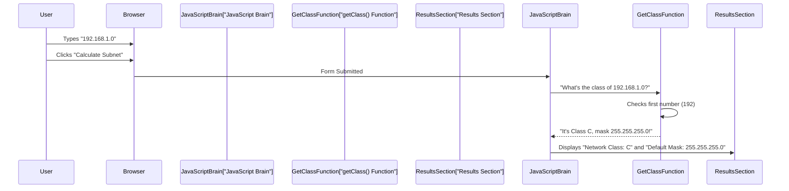

# Chapter 3: IP Class Determination

Welcome back to the **Sub-Cal** project! In the [previous chapter](02_client_side_interaction___display_logic_.md), we learned that `Sub-Cal` has a "brain" (JavaScript) that listens to your clicks and prepares to do calculations. Now, let's dive into the *first actual calculation* `Sub-Cal` performs: figuring out an IP address's "Class".

### What is IP Class Determination?

Imagine you're a bouncer at a big network party, and every device (like your computer or phone) needs an "Internet Protocol" (IP) address to get in. Before you let anyone in, you need to check their ID to see what kind of network they belong to.

This "ID check" for IP addresses is exactly what **IP Class Determination** does. It's the part of `Sub-Cal` that looks at an IP address and says, "Aha! This IP address belongs to Class A, B, or C!"

### Why is Knowing the IP Class Important?

You might wonder, "Why do we care about these 'classes'?" Good question! In the early days of the internet, IP addresses were grouped into these classes (A, B, C) to help organize networks. Each class came with a **standard, default subnet mask**.

Think of the default subnet mask as the "default fence" around a network.
*   A Class A network has a very large default fence, allowing for many devices.
*   A Class B network has a medium default fence.
*   A Class C network has a smaller default fence, meant for fewer devices.

Knowing this default fence (mask) is the **starting point** for `Sub-Cal`'s more advanced calculations. It tells `Sub-Cal` the original, large block of IP addresses we're working with before we start dividing it into smaller subnets.

### Understanding IP Addresses and Their Classes

An IP address (like `192.168.1.1`) is made of four numbers separated by dots. Each number can go from 0 to 255. These four numbers are often called "octets."

To determine an IP address's class, `Sub-Cal` only needs to look at the **first octet** (the very first number).

Here's how the first octet tells us the class:

| IP Class | First Octet Range | Default Subnet Mask | Analogy: Size of "Building" |
| :------- | :---------------- | :------------------ | :-------------------------- |
| **Class A** | 1 to 126          | 255.0.0.0           | Very Large Campus (Millions of devices) |
| **Class B** | 128 to 191        | 255.255.0.0         | Medium-sized Office (Thousands of devices) |
| **Class C** | 192 to 223        | 255.255.255.0       | Small Office/Home (Hundreds of devices) |
| *Other* | 0, 127, 224-255    | N/A                 | Reserved or Special Use     |

*Note: The number 127 is usually reserved for "loopback" (your own computer talking to itself), and numbers above 223 are for special uses like "multicast."*

### Our Use Case: Finding the Class of an IP

Let's use our example IP address: `192.168.1.0`. When you type this into `Sub-Cal` and click "Calculate", one of the first things the program does is to determine its class.

1.  `Sub-Cal` looks at `192.168.1.0`.
2.  It takes the **first octet**: `192`.
3.  It checks the table above:
    *   Is `192` between 1 and 126? No.
    *   Is `192` between 128 and 191? No.
    *   Is `192` between 192 and 223? Yes!
4.  `Sub-Cal` determines that `192.168.1.0` is a **Class C** IP address, and its **default subnet mask is 255.255.255.0**.

### How Sub-Cal Does It: Under the Hood

When you click the "Calculate Subnet" button, the JavaScript "brain" we talked about in [Chapter 2: Client-Side Interaction & Display Logic](02_client_side_interaction___display_logic_.md) takes over. One of its very first actions is to call a special helper function that performs this class determination.

Here's a simplified look at the flow:



### A Closer Look at the Code

Let's peek at the `getClass` function directly from `light-sub-cal.html` (or `index.html`) that handles this.

```javascript
// File: light-sub-cal.html (or index.html)

function getClass(ip) {
    // 1. Split the IP address string into parts (numbers)
    const ipParts = ip.split('.'); // e.g., "192.168.1.0" becomes ["192", "168", "1", "0"]

    // 2. Get the first number (first octet) and turn it into a real number
    const firstOctet = parseInt(ipParts[0]); // e.g., "192" becomes 192

    // 3. Check the range of the first octet to determine the class
    if (1 <= firstOctet && firstOctet <= 126) {
        return { class: "A", mask: "255.0.0.0" };
    } else if (128 <= firstOctet && firstOctet <= 191) {
        return { class: "B", mask: "255.255.0.0" };
    } else if (192 <= firstOctet && firstOctet <= 223) {
        return { class: "C", mask: "255.255.255.0" };
    } else {
        // For any other numbers (like 0, 127, or above 223)
        return { class: "Unknown", mask: "N/A" };
    }
}
```

Let's break down this small but mighty piece of code:

*   `function getClass(ip)`: This defines a reusable block of code named `getClass`. It takes one piece of information, `ip` (which will be the IP address string like "192.168.1.0").
*   `ip.split('.')`: An IP address is a string of numbers separated by dots. `split('.')` breaks this string into an array (a list) of individual strings, using the dot as the separator. So, `"192.168.1.0"` becomes `["192", "168", "1", "0"]`.
*   `ipParts[0]`: In programming, lists start counting from 0. So, `ipParts[0]` gives us the *first* item in the list, which is the first octet (e.g., `"192"`).
*   `parseInt(...)`: The `split` function gives us numbers as *text* (strings). `parseInt()` converts that text into a proper whole number (an "integer") so we can do math with it (like checking if it's `>= 192`).
*   `if (...) { ... } else if (...) { ... } else { ... }`: This is a common programming structure that makes decisions.
    *   It checks the first condition (`1 <= firstOctet && firstOctet <= 126`). If true, it returns Class A.
    *   If false, it moves to the next `else if` and checks that condition.
    *   It continues until one condition is true, or it reaches the final `else` if none of the specific class ranges match.
*   `return { class: "A", mask: "255.0.0.0" };`: When a class is found, the function `return`s an object (a bundle of related information) containing both the `class` (like "A") and its `mask` (like "255.0.0.0"). This object is then sent back to the `JavaScriptBrain` to be used in later calculations and displayed on the screen.

This `getClass` function acts as the "gatekeeper," quickly identifying the fundamental nature of the IP address, which is essential for all the calculations that follow.

### Conclusion

In this chapter, you learned about **IP Class Determination**, the very first step `Sub-Cal` takes when you input an IP address. You now understand that this process identifies whether an IP is Class A, B, or C by simply looking at its first number. This classification is crucial because it immediately tells `Sub-Cal` the **default subnet mask**, which is the starting point for all subsequent subnetting calculations.

Now that we know the basic "identity" of our IP address, we can move on to the next crucial step: figuring out how many "host bits" and "subnet bits" are needed for your network requirements. This will be covered in **[Chapter 4: Host & Subnet Bit Calculation](04_host___subnet_bit_calculation_.md)**!

---
