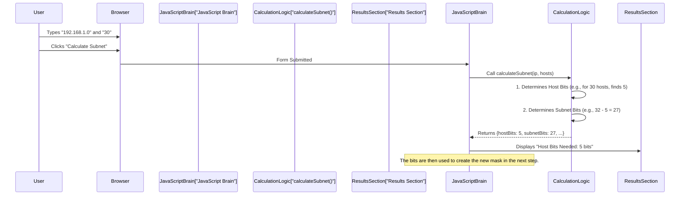

# Chapter 4: Host & Subnet Bit Calculation

Welcome back to the **Sub-Cal** project! In the [previous chapter](03_ip_class_determination_.md), we saw how `Sub-Cal` determines the "Class" of an IP address and its default subnet mask. That's a great start, but what if you need a network that doesn't just use the *default* settings? What if you need to create smaller networks (subnets) that fit a very specific number of devices?

### What is Host & Subnet Bit Calculation?

Imagine you're designing rooms in a new building. You know the *total* space available (the entire network, 32 bits for an IPv4 address). In the last chapter, we figured out the *default* size of the main rooms (Class A, B, or C).

Now, you have a special request: "I need each room to hold at least `30` chairs!"

**Host & Subnet Bit Calculation** is the critical step where `Sub-Cal` figures out how many binary "slots" (bits) are absolutely necessary to accommodate those `30` chairs (host devices) within each of your new, smaller rooms (subnets).

Once it knows how many "slots" are needed for chairs, it subtracts that from the total "building space" (32 bits) to see how many "slots" are left over for creating and naming the *different* rooms. This calculation directly decides:
*   How many unique devices can fit in each subnet.
*   How many different subnets you can create in total.

### Why is This Calculation So Important?

This is the very heart of **subnetting**! Without this step, you wouldn't be able to customize your network to efficiently use IP addresses. If you need 30 devices, you don't want to accidentally create a subnet that can hold 250 devices, wasting many IP addresses. This calculation helps you find the perfect size.

### Our Use Case: Calculating Bits for 30 Hosts

Let's stick with our example. You entered `192.168.1.0` as the IP address and `30` as the `Hosts per Subnet`.

From Chapter 3, we know `192.168.1.0` is a **Class C** IP, with a default subnet mask of `255.255.255.0`. Now, `Sub-Cal` needs to adapt this to fit `30` hosts.

Here's how `Sub-Cal` approaches it:

1.  **How many bits do we need for `30` hosts? (Host Bits)**
    *   IP addresses are made of binary "bits" (0s and 1s). Each bit can be "on" or "off."
    *   If you have `N` bits, you can create `2^N` unique combinations.
    *   However, for any subnet, two addresses are always reserved: one for the **network address** (the name of the subnet) and one for the **broadcast address** (used to talk to *all* devices in that subnet).
    *   So, the number of *usable* host addresses is `2^N - 2`.
    *   `Sub-Cal` needs to find the smallest `N` (number of host bits) such that `2^N - 2` is *greater than or equal to* your `required_hosts` (`30`).

    Let's try some `N` values:
    *   If `N = 1`: `2^1 - 2 = 0` (Not enough for 30 hosts)
    *   If `N = 2`: `2^2 - 2 = 2` (Not enough)
    *   If `N = 3`: `2^3 - 2 = 6` (Not enough)
    *   If `N = 4`: `2^4 - 2 = 14` (Not enough)
    *   If `N = 5`: `2^5 - 2 = 30` (Exactly enough!)

    So, for `30` required hosts, `Sub-Cal` determines that you need **5 host bits**.

2.  **How many bits are left for identifying subnets? (Subnet Bits)**
    *   An IPv4 address has a total of **32 bits**.
    *   If `5` bits are used for hosts, the rest must be used for the network/subnet part.
    *   `Subnet Bits = Total Bits - Host Bits`
    *   `Subnet Bits = 32 - 5 = 27`

    So, `Sub-Cal` calculates that your new subnet mask will use **27 bits** to identify subnets.

These two numbers, **5 host bits** and **27 subnet bits**, are the core output of this calculation and will be used in the next steps!

### How Sub-Cal Does It: Under the Hood

When you click "Calculate Subnet" after entering the IP and required hosts, the JavaScript "brain" (from [Chapter 2: Client-Side Interaction & Display Logic](02_client_side_interaction___display_logic_.md)) first determines the IP class (from [Chapter 3: IP Class Determination](03_ip_class_determination_.md)), then immediately proceeds to this bit calculation.

Here’s a simplified flow:



### A Closer Look at the Code

This calculation happens inside the `calculateSubnet` function in your `light-sub-cal.html` (or `index.html`) file.

Here are the key lines of code for this chapter:

```javascript
// File: light-sub-cal.html (or index.html)

function calculateSubnet(ipStr, requiredHosts) {
    // ... (previous code for getting IP class and default mask) ...

    // Calculate how many bits are needed for host part
    // Math.log2(X) gives you the power to which 2 must be raised to get X.
    // We add 2 to requiredHosts because we need space for the network and broadcast addresses.
    // Math.ceil() rounds up to the nearest whole number because bits must be whole.
    const hostBits = Math.ceil(Math.log2(requiredHosts + 2)); 

    // Calculate the remaining bits for the subnet part
    // An IPv4 address is always 32 bits long.
    const subnetBits = 32 - hostBits;

    // ... (rest of the calculation function) ...

    return {
        // ... (other calculated properties) ...
        requiredHosts: requiredHosts,
        hostBits: hostBits,
        subnetBits: subnetBits,
        // ...
    };
}
```

Let's break down these lines:

*   `const hostBits = Math.ceil(Math.log2(requiredHosts + 2));`
    *   `requiredHosts + 2`: This is crucial! If you need 30 usable hosts, you actually need 32 total addresses (`30` usable + `1` for network address + `1` for broadcast address).
    *   `Math.log2(...)`: This is a mathematical function that tells you "what power do I need to raise 2 to, to get this number?". For example, `Math.log2(32)` would be `5` because `2^5 = 32`.
    *   `Math.ceil(...)`: Since you can't have half a bit, `Math.ceil()` (ceiling) always rounds the result *up* to the nearest whole number. If `Math.log2(requiredHosts + 2)` came out to `4.1`, you'd still need 5 bits to cover the required addresses.
    *   The result is stored in `hostBits`. For `requiredHosts = 30`, `hostBits` will be `5`.

*   `const subnetBits = 32 - hostBits;`
    *   Since an IPv4 address is always `32` bits long, and we've determined how many bits are for hosts, the rest *must* be for defining the subnet.
    *   The result is stored in `subnetBits`. For `hostBits = 5`, `subnetBits` will be `27`.

These two calculated values (`hostBits` and `subnetBits`) are then passed along to other parts of `Sub-Cal` to construct the new subnet mask and CIDR notation, which is exactly what we'll cover next!

### Conclusion

In this chapter, you've learned that **Host & Subnet Bit Calculation** is the fundamental step where `Sub-Cal` intelligently determines the binary "slots" needed to satisfy your requirement for a specific number of host devices within each subnet. By calculating the necessary `hostBits` (using `2^N - 2`) and subtracting that from the total 32 bits to get `subnetBits`, `Sub-Cal` sets the stage for creating an efficient, custom network.

Now that we know exactly how many bits need to be dedicated to the subnet part of the address, we can use this information to create the actual new subnet mask and its CIDR notation. This is what we'll explore in **[Chapter 5: Subnet Mask & CIDR Generation](05_subnet_mask___cidr_generation_.md)**!

---
