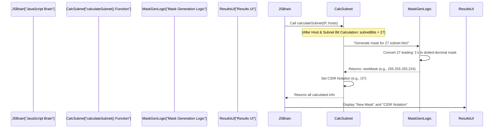

# Chapter 5: Subnet Mask & CIDR Generation

Welcome back to the **Sub-Cal** project! In the [previous chapter](04_host___subnet_bit_calculation_.md), we performed a crucial calculation: determining the exact number of "host bits" (how many binary slots are needed for devices) and, by extension, the "subnet bits" (how many binary slots are left for identifying different networks). For our example of `192.168.1.0` with `30` hosts, we found we needed `5 host bits`, leaving `27 subnet bits`.

But how do we tell a computer or network device about these `27 subnet bits`? Computers don't usually understand "27 subnet bits" directly. They need something more concrete.

### What is Subnet Mask & CIDR Generation?

Imagine you've designed a building floor plan and know exactly how many "network" sections you need for your different teams. Now, you need to actually *draw the walls* on the blueprint and give each section a clear "label" for easy reference.

**Subnet Mask & CIDR Generation** is this process. It takes the calculated number of "subnet bits" (like 27) and converts it into two standard, recognizable forms that network devices understand:

1.  **Subnet Mask (Dotted Decimal Notation):** This looks like an IP address itself (e.g., `255.255.255.192`). It's a 32-bit number where '1's mark the "network part" of an IP address and '0's mark the "host part."
2.  **CIDR Notation (Classless Inter-Domain Routing):** This is a shorter, simpler way to express the subnet mask, like `/26`. It's just a slash followed by the total count of the '1's in the subnet mask.

This abstraction is vital because it provides the concrete "fence" that defines the boundaries of each subnet. Devices use this mask to figure out which other devices are in their local network and which are on a different network, requiring a router to communicate.

### Why is This Generation Important?

Without a clear subnet mask, network devices wouldn't know how to divide IP addresses into their network and host portions. They wouldn't know which part of an IP identifies the specific "room" (subnet) and which part identifies the "chair" (device) within that room. This step makes our theoretical bit calculations practical and usable in a real network.

### Our Use Case: Generating the Mask and CIDR

Let's continue with our running example:
*   **IP Address:** `192.168.1.0`
*   **Required Hosts:** `30`
*   **Calculated from Chapter 4:** `5 host bits` and `27 subnet bits`.

Now, `Sub-Cal` uses these `27 subnet bits` to generate the new subnet mask and CIDR notation.

Here's the idea:
1.  **Subnet Mask:** Since we have `27 subnet bits`, it means the first 27 bits of our 32-bit subnet mask will be '1's, and the remaining 5 bits will be '0's.
    *   In binary, this looks like: `11111111.11111111.11111111.11100000`
    *   `Sub-Cal` then converts each 8-bit section (octet) into its decimal value:
        *   `11111111` (first octet) = `255`
        *   `11111111` (second octet) = `255`
        *   `11111111` (third octet) = `255`
        *   `11100000` (fourth octet) = `192`
    *   So, the new Subnet Mask is `255.255.255.224`.

2.  **CIDR Notation:** This is simply the number of `subnet bits` prefaced by a slash.
    *   Since we have `27 subnet bits`, the CIDR notation is `/27`.

This means for your `192.168.1.0` network needing `30` hosts per subnet, `Sub-Cal` will tell you the new subnet mask is `255.255.255.224` or `/27`.

### How Sub-Cal Does It: Under the Hood

After `Sub-Cal` calculates the `subnetBits` (as discussed in [Chapter 4: Host & Subnet Bit Calculation](04_host___subnet_bit_calculation_.md)), it immediately proceeds to construct the new subnet mask and its CIDR notation.

Here’s a simplified flow of what happens:



### A Closer Look at the Code

This part of the calculation happens within the `calculateSubnet` function in your `light-sub-cal.html` (or `index.html`) file. Specifically, after `hostBits` and `subnetBits` are determined, the code builds the `newMask` string.

```javascript
// File: light-sub-cal.html (or index.html)

function calculateSubnet(ipStr, requiredHosts) {
    // ... (previous code for getting IP class and calculating hostBits, subnetBits) ...

    const subnetBits = 32 - hostBits; // Let's say this is 27

    // Calculate new subnet mask
    let newMask = ''; // This will store "255.255.255.224"
    let newMaskBinary = ''; // This will store "11111111.11111111.11111111.11100000"

    if (subnetBits >= 0 && subnetBits <= 32) {
        const octets = []; // An array to build the four numbers of the mask
        let remainingBits = subnetBits; // Start with our calculated subnet bits (e.g., 27)

        for (let i = 0; i < 4; i++) { // Loop for each of the four octets (parts) of the mask
            if (remainingBits >= 8) {
                octets.push(255); // If we have 8 or more '1's left, the octet is 255 (all 8 bits are 1)
                remainingBits -= 8; // Subtract these 8 bits
            } else if (remainingBits > 0) {
                // This is for the "partial" octet (e.g., for 3 remaining bits, it's 11100000 = 224)
                const octet = 256 - Math.pow(2, 8 - remainingBits);
                octets.push(octet); // Add the calculated value to our list
                remainingBits = 0; // All remaining bits have been used for this octet
            } else {
                octets.push(0); // If no more '1's are left, the octet is 0 (all 8 bits are 0)
            }
        }

        newMask = octets.join('.'); // Join the numbers with dots to form "X.X.X.X"
        // This helper function (from Chapter 4 context) converts "X.X.X.X" to its binary string
        newMaskBinary = binaryMask(newMask);
    } else {
        newMask = "Invalid"; // In case of unexpected bit count
        newMaskBinary = "Invalid";
    }

    // CIDR Notation is simply the number of subnet bits
    const cidrNotation = `/${subnetBits}`;

    return {
        // ... (other calculated properties like IP, class, etc.) ...
        subnetBits: subnetBits,
        newMask: newMask,
        newBinary: newMaskBinary, // The binary representation of the new mask
        cidrNotation: cidrNotation,
        // ... (other properties for Hosts per Network/Subnet and Ranges) ...
    };
}
```

Let's break down the core logic for generating `newMask`:

*   `const octets = [];`: This creates an empty list where `Sub-Cal` will store the four decimal numbers (like `255`, `255`, `255`, `192`) that make up the subnet mask.
*   `let remainingBits = subnetBits;`: This variable keeps track of how many '1' bits from our `subnetBits` (e.g., 27) we still need to assign to the octets.
*   `for (let i = 0; i < 4; i++)`: This loop runs four times, once for each of the four numbers (octets) in an IP address.
*   **`if (remainingBits >= 8)`**: If we still have 8 or more `1`s to place, it means the entire current octet is filled with `1`s. `11111111` in binary is `255` in decimal. So, `255` is added to our `octets` list, and `8` bits are subtracted from `remainingBits`.
*   **`else if (remainingBits > 0)`**: This is the important part for the "partial" octet. If `remainingBits` is less than 8 but more than 0 (e.g., 3 bits for `/27`), it means only *some* of the bits in this octet will be `1`s.
    *   `const octet = 256 - Math.pow(2, 8 - remainingBits);`: This is the formula to calculate the decimal value of that partial octet.
        *   For `remainingBits = 3`, `8 - remainingBits` is `5`.
        *   `Math.pow(2, 5)` is `32`.
        *   `256 - 32` is `224`.
        *   This precisely gives us `224` for the `11100000` binary pattern. This formula essentially figures out the value by "turning off" the bits that correspond to the host portion within that octet.
*   **`else`**: If `remainingBits` is `0`, it means all the network bits have been placed. The rest of the octets will be `0` (meaning `00000000` in binary).
*   `newMask = octets.join('.');`: After the loop finishes, all four numbers are in the `octets` list. This line combines them into a single string like `255.255.255.224`.
*   `cidrNotation = `/${subnetBits}`;`: This is straightforward. It simply takes the calculated `subnetBits` value (e.g., `27`) and puts a `/` in front of it to form the CIDR notation (e.g., `/27`).

These `newMask` and `cidrNotation` values are then included in the `subnetInfo` object that `calculateSubnet` returns, allowing the `displayResults` function (as seen in [Chapter 2: Client-Side Interaction & Display Logic](02_client_side_interaction___display_logic_.md)) to show them neatly on the webpage.

### Conclusion

In this chapter, you learned how **Subnet Mask & CIDR Generation** takes the precise number of "subnet bits" calculated earlier and transforms them into the familiar dotted-decimal subnet mask (like `255.255.255.224`) and the compact CIDR notation (like `/27`). This is the step that translates the abstract binary bit counts into a practical network configuration that computers understand, effectively drawing the "walls" for our custom subnets.

Now that we have the new subnet mask, `Sub-Cal` has all the information it needs to list out all the specific network and broadcast addresses for each of your new subnets. This is what we'll explore in the next exciting step: **[Chapter 6: Network Range Enumeration](06_network_range_enumeration_.md)**!

---
