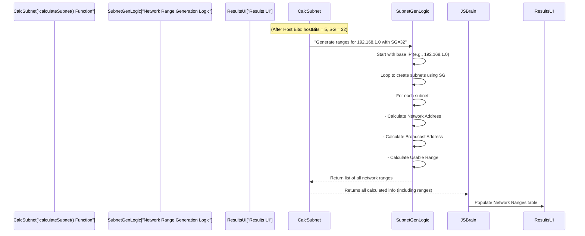

# Chapter 6: Network Range Enumeration

Welcome back to the **Sub-Cal** project! In the [previous chapter](05_subnet_mask___cidr_generation_.md), we learned how `Sub-Cal` takes your "host bits" requirement and generates a practical **Subnet Mask** (like `255.255.255.224`) and its **CIDR Notation** (like `/27`). This new mask acts like the blueprint for dividing your large network into smaller, efficient pieces.

But how do we actually *see* these smaller pieces? The mask tells us *how* to divide, but not *what* the new network segments (subnets) *are*.

### What is Network Range Enumeration?

Imagine you're a city planner, and you've decided to divide a large piece of land into smaller plots for individual houses. You've drawn the boundary lines (that's your subnet mask from the last chapter).

Now, **Network Range Enumeration** is like a cartographer mapping out each and every one of those individual land plots. For each plot, the cartographer notes down:

1.  **The Plot's Official Name (Network Address):** This is the very first address in that plot. It's like the street address that identifies the entire block.
2.  **The Plot's Full Boundary (Broadcast Address):** This is the very last address in that plot. It's like the address you'd use to send a message to *everyone* living on that specific plot.
3.  **The Usable Spaces Within the Plot (Usable Host Range):** These are all the addresses in between the "name" and the "boundary" addresses. These are the actual spots where you can build houses (assign IP addresses to devices).

`Sub-Cal` performs this exact process for network subnets. After calculating the new subnet mask, this step systematically lists out all the individual network segments (subnets) that can be created. For each subnet, it calculates and presents its Network Address, Broadcast Address, and the Usable Host Range.

### Why is This Information Important?

This is where all the subnetting calculations come together to provide you with concrete, actionable information. You can't just tell a computer "use /27." You need to know:
*   "What is the first IP address for the first department's network?"
*   "What is the last address for the marketing team's network?"
*   "What IP addresses can I actually give to my new servers in this subnet?"

Network Range Enumeration answers these questions, giving you a clear map of your new network structure.

### Our Use Case: Listing the Subnets for 192.168.1.0/27

Let's continue with our example:
*   **IP Address:** `192.168.1.0`
*   **Required Hosts:** `30`
*   **Calculated from Chapter 5:** New Subnet Mask `255.255.255.224` (or `/27`)

From [Chapter 4: Host & Subnet Bit Calculation](04_host___subnet_bit_calculation_.md), we also know that `/27` means we have **5 host bits**. This tells us how many total addresses are in each subnet block: `2^5 = 32` addresses. This "block size" is critical for enumeration.

`Sub-Cal` will now use this information to list out the subnets. Since each subnet will contain `32` addresses, they will be chunks of 32 in the last octet (the fourth number of the IP address).

Here's what `Sub-Cal` will show you for the first few subnets:

| Subnet | Network Address | Broadcast Address | Usable Range |
| :----- | :-------------- | :---------------- | :----------- |
| 1      | 192.168.1.0     | 192.168.1.31      | 192.168.1.1 - 192.168.1.30 |
| 2      | 192.168.1.32    | 192.168.1.63      | 192.168.1.33 - 192.168.1.62 |
| 3      | 192.168.1.64    | 192.168.1.95      | 192.168.1.65 - 192.168.1.94 |
| ...    | ...             | ...               | ...          |

Each row represents a separate, usable subnet within your `192.168.1.0` network, each capable of hosting `30` devices.

### How Sub-Cal Does It: Under the Hood

After calculating the `hostBits` (which also gives us the `SG`, or "Subnet Group Size," which is `2^hostBits`), `Sub-Cal` proceeds to enumerate the ranges.

Here’s a simplified flow:



### A Closer Look at the Code

This part of the calculation also happens within the `calculateSubnet` function in your `light-sub-cal.html` (or `index.html`) file, specifically in the section that builds the `networkRanges` array.

```javascript
// File: light-sub-cal.html (or index.html)

function calculateSubnet(ipStr, requiredHosts) {
    // ... (previous code for getting IP class, calculating hostBits, subnetBits, and newMask) ...

    // Determine subnet group size (SG)
    // This is the number of addresses in each subnet, including network and broadcast.
    const SG = Math.pow(2, hostBits); // For 5 host bits, SG = 2^5 = 32

    // ... (other calculations like totalOnes, totalZeros, hostPerNetwork/Subnet) ...

    // Calculate network ranges
    const networkRanges = []; // This will store all our subnet details

    // We take the input IP, split it, and focus on the last octet for calculations.
    const ipParts = ipStr.split('.'); // e.g., "192.168.1.0" becomes ["192", "168", "1", "0"]

    // Loop to generate a few subnets (the demo limits to 5 for simplicity)
    for (let i = 0; i < 5; i++) {
        // Calculate the Network Address for this subnet
        // We assume the first three octets stay the same for Class C example
        // The last octet starts at 0, then 32, then 64, etc.
        const networkAddress = `${ipParts[0]}.${ipParts[1]}.${ipParts[2]}.${i * SG}`;

        // Calculate the Broadcast Address for this subnet
        // It's the Network Address + Subnet Group Size - 1
        const broadcastAddress = `${ipParts[0]}.${ipParts[1]}.${ipParts[2]}.${(i * SG) + SG - 1}`;

        // Calculate the Usable Host Range
        // Usable Start: Network Address + 1
        const usableStart = `${ipParts[0]}.${ipParts[1]}.${ipParts[2]}.${(i * SG) + 1}`;
        // Usable End: Broadcast Address - 1
        const usableEnd = `${ipParts[0]}.${ipParts[1]}.${ipParts[2]}.${(i * SG) + SG - 2}`;

        // Add this subnet's details to our list
        networkRanges.push({
            subnet: i + 1, // Subnet number (1, 2, 3...)
            network: networkAddress,
            broadcast: broadcastAddress,
            usable: `${usableStart} - ${usableEnd}` // Format as a range string
        });
    }

    return {
        // ... (all other calculated properties) ...
        networkRanges: networkRanges // Return the list of ranges
    };
}
```

Let's break down this part of the code:

*   `const SG = Math.pow(2, hostBits);`: This line calculates the **Subnet Group Size (SG)**. Since `hostBits` for our example is `5`, `SG` becomes `2^5 = 32`. This means each subnet will contain 32 IP addresses in total.
*   `const networkRanges = [];`: This creates an empty list where `Sub-Cal` will store the details (network, broadcast, usable IPs) for each subnet it finds.
*   `const ipParts = ipStr.split('.');`: This splits the input IP address (like "192.168.1.0") into its four number parts, so we can work with them individually.
*   `for (let i = 0; i < 5; i++)`: This `for` loop is set up to generate a few example subnets. In a full-featured calculator, it would generate *all* possible subnets within the original network.
*   **`networkAddress` calculation:**
    *   `${ipParts[0]}.${ipParts[1]}.${ipParts[2]}.${i * SG}`: This constructs the network address. For our Class C example, the first three parts of the IP (like `192.168.1`) stay the same. Only the last part changes.
    *   `i * SG`: This is the magic!
        *   For `i = 0` (first subnet): `0 * 32 = 0`. So, `192.168.1.0`.
        *   For `i = 1` (second subnet): `1 * 32 = 32`. So, `192.168.1.32`.
        *   For `i = 2` (third subnet): `2 * 32 = 64`. So, `192.168.1.64`.
        This effectively lists the starting address of each block of 32 IPs.
*   **`broadcastAddress` calculation:**
    *   `${(i * SG) + SG - 1}`: This builds the broadcast address. It takes the network address of the current block and adds the `SG` (the total number of addresses in the block), then subtracts 1 (because the counting starts from 0).
        *   For `192.168.1.0` (SG=32): `0 + 32 - 1 = 31`. So, `192.168.1.31`.
        *   For `192.168.1.32` (SG=32): `32 + 32 - 1 = 63`. So, `192.168.1.63`.
*   **`usableStart` and `usableEnd` calculation:**
    *   `usableStart`: Simply the `networkAddress`'s last octet plus 1.
    *   `usableEnd`: Simply the `broadcastAddress`'s last octet minus 1.
    These define the range of addresses that can be assigned to devices.

Finally, `networkRanges.push(...)` adds all these calculated details for the current subnet to the `networkRanges` list.

Once the `calculateSubnet` function returns this `networkRanges` data, the `displayResults` function (which we briefly saw in [Chapter 2: Client-Side Interaction & Display Logic](02_client_side_interaction___display_logic_.md)) takes this list and dynamically populates the "Network Ranges" table on the `Sub-Cal` webpage, making it easy to read and understand.

### Conclusion

In this chapter, you've mastered **Network Range Enumeration**, the crucial step where `Sub-Cal` maps out all the individual network segments (subnets) based on the calculated subnet mask. You now understand how `Sub-Cal` systematically determines the Network Address, Broadcast Address, and Usable Host Range for each subnet, providing a clear and practical breakdown of your network.

All these calculations rely on understanding how IP addresses and masks are represented internally using binary numbers. In our final chapter, we'll take a quick look at the fundamental concept of **[Binary IP/Mask Conversion](07_binary_ip_mask_conversion_.md)** to see how these numbers look to a computer!

---
