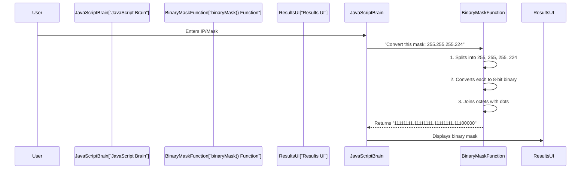

# Chapter 7: Binary IP/Mask Conversion

Welcome to the final chapter of our **Sub-Cal** journey! In the [previous chapter](06_network_range_enumeration_.md), we saw how `Sub-Cal` enumerates all the distinct network ranges, giving you a clear list of network addresses, broadcast addresses, and usable IP ranges. All those numbers (like `192.168.1.0` or `255.255.255.224`) are easy for humans to read.

But here's a secret: computers don't understand numbers like "192" or "255" in the same way we do. They think in a much simpler language: **binary**.

### What is Binary IP/Mask Conversion?

Imagine that every letter you read in a book has a secret code behind it, made up of just two symbols: `0` (off) and `1` (on). Computers work exactly like this! Everything they process, including IP addresses and subnet masks, must first be translated into a series of `0`s and `1`s. This is called **binary**.

**Binary IP/Mask Conversion** is the utility component within `Sub-Cal` that is responsible for:
1.  Taking human-readable IP addresses (like `"192.168.1.0"`) and subnet masks (like `"255.255.255.0"`).
2.  Translating each number (octet) into its equivalent 8-bit binary form.
3.  Ensuring each 8-bit section is "padded" with leading zeros if necessary (e.g., `1` is `00000001`, not just `1`).
4.  Presenting the full 32-bit binary representation, neatly divided by dots.

### Why is Binary Conversion Important?

You might wonder, "Why do I need to see the binary form if `Sub-Cal` already gives me the human-readable numbers?"

Here's why it's crucial:
*   **The Computer's Language:** This is how computers fundamentally see and process IP addresses and subnet masks. It reveals the "raw" data.
*   **The Core of Subnetting:** The magic of subnetting, especially how a network address is derived from an IP address and a subnet mask, relies entirely on a "bitwise AND" operation. This operation can *only* be performed in binary! By showing you the binary, `Sub-Cal` helps you understand the underlying mechanics.
*   **Clarity on Network vs. Host:** In binary, it becomes crystal clear which bits belong to the "network part" (often marked by `1`s in the mask) and which belong to the "host part" (marked by `0`s in the mask).

`Sub-Cal` converts these numbers internally to perform its calculations, and it displays them to you so you can gain a deeper understanding of how subnetting truly works.

### Understanding Binary Numbers and Octets

An IPv4 address (like `192.168.1.0`) is a 32-bit number, usually broken into four sections of 8 bits each. Each 8-bit section is called an **octet**.

Think of an octet as a "byte" or a group of 8 switches. Each switch can be either `0` (off) or `1` (on).

Here's how some decimal numbers look in 8-bit binary:

| Decimal | 8-bit Binary | Explanation (Weight of each position) |
| :------ | :----------- | :---------------------------------- |
| `0`     | `00000000`   | All switches off                    |
| `1`     | `00000001`   | Only the last switch is on (`2^0 = 1`) |
| `10`    | `00001010`   | `(2^3) + (2^1) = 8 + 2 = 10`       |
| `192`   | `11000000`   | `(2^7) + (2^6) = 128 + 64 = 192`   |
| `224`   | `11100000`   | `(2^7) + (2^6) + (2^5) = 128 + 64 + 32 = 224` |
| `255`   | `11111111`   | All switches on                     |

Notice how `0`s are added to the left (leading zeros) to make sure every octet is exactly 8 bits long. `Sub-Cal` ensures this 8-bit format for every octet.

### Our Use Case: Converting IP and Mask to Binary

Let's use our example IP address and its newly calculated subnet mask:
*   **IP Address:** `192.168.1.0`
*   **New Subnet Mask:** `255.255.255.224` (from [Chapter 5: Subnet Mask & CIDR Generation](05_subnet_mask___cidr_generation_.md))

When `Sub-Cal` performs the binary conversion, here's what it would look like:

**Original IP Address: `192.168.1.0`**
*   `192` becomes `11000000`
*   `168` becomes `10101000`
*   `1` becomes `00000001`
*   `0` becomes `00000000`
**Full 32-bit Binary IP:** `11000000.10101000.00000001.00000000`

**New Subnet Mask: `255.255.255.224`**
*   `255` becomes `11111111`
*   `255` becomes `11111111`
*   `255` becomes `11111111`
*   `224` becomes `11100000`
**Full 32-bit Binary Mask:** `11111111.11111111.11111111.11100000`

Notice the patterns of `1`s and `0`s in the mask. The `1`s represent the "network" part, and the `0`s represent the "host" part. This is where the magic of subnetting happens!

### How Sub-Cal Does It: Under the Hood

The `Sub-Cal` tool uses a simple JavaScript function to perform this conversion. It takes an IP address or mask in its dotted-decimal format (like `255.255.255.0`), splits it into its four octets, converts each octet to binary, and then rejoins them with dots.

Here’s a simplified flow:



### A Closer Look at the Code

The core of this conversion is handled by the `binaryMask` function in the `light-sub-cal.html` (or `index.html`) file:

```javascript
// File: light-sub-cal.html (or index.html)

function binaryMask(mask) {
    // 1. Split the mask string into individual octets (e.g., ["255", "255", "255", "224"])
    return mask.split('.').map(octet => {
        // 2. Convert each octet (which is text) into a whole number (integer)
        // 3. Convert that number to its binary representation (e.g., 255 -> "11111111")
        // 4. Ensure it's 8 bits long by adding leading zeros if needed (e.g., "1" -> "00000001")
        return parseInt(octet).toString(2).padStart(8, '0');
    }).join('.'); // 5. Join the 8-bit binary strings back with dots
}
```

Let's break down this powerful one-liner:

*   `mask.split('.')`: This takes the input string (like `"255.255.255.224"`) and splits it into an array (a list) of strings, using the dot `.` as the separator. So, you get `["255", "255", "255", "224"]`.
*   `.map(octet => { ... })`: This is a common JavaScript trick. It goes through *each item* in the array (`octet` refers to each number like "255") and applies a transformation to it.
*   `parseInt(octet)`: This converts the current `octet` string (e.g., `"192"`) into a real number (e.g., `192`).
*   `.toString(2)`: This is the magic! It's a built-in JavaScript function that converts a number into its *binary* string representation. So, `192.toString(2)` gives `"11000000"`, and `1.toString(2)` gives `"1"`.
*   `.padStart(8, '0')`: This is crucial for consistency. If the binary string isn't yet 8 characters long (like `"1"` for decimal 1), `padStart(8, '0')` adds leading `0`s until it is 8 characters. So `"1"` becomes `"00000001"`.
*   `.join('.')`: After all the octets have been converted and padded, this takes the list of 8-bit binary strings and joins them back together with dots in between, resulting in the final `32-bit binary` representation like `11000000.10101000.00000001.00000000`.

This `binaryMask` function is called by `calculateSubnet` (which we saw in previous chapters) for both the default mask and the new calculated mask, and the results are then displayed on the `Sub-Cal` user interface.

### Conclusion

In this chapter, you've understood the fundamental concept of **Binary IP/Mask Conversion**. You learned that computers process IP addresses and subnet masks in binary (0s and 1s), and how `Sub-Cal` translates these human-readable numbers into their 32-bit binary equivalents, padding each octet to ensure an 8-bit format. This conversion is not just for display; it's the very foundation upon which all subnetting calculations (like the bitwise AND operation) are performed.

This marks the end of our journey through the **Sub-Cal** project. You've now seen how the tool's intuitive user interface leads you through complex calculations, from identifying IP classes and calculating host bits, to generating subnet masks, enumerating network ranges, and finally, understanding the underlying binary language that powers it all. We hope this tutorial has demystified subnetting and empowered you with a better grasp of network fundamentals!

---