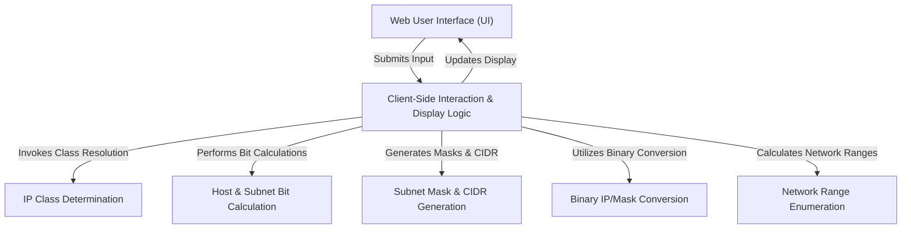

# Tutorial: Sub-Cal

The `Sub-Cal` project is a **subnetting calculator** designed to help users understand and design *network configurations*. It takes an **IP address** and a desired number of *hosts per subnet* as input, then calculates and displays detailed information such as the **IP class**, the *new subnet mask* in dot-decimal and CIDR notation, and a list of all resulting **network ranges** (including network, broadcast, and usable IP addresses).

## Visual Overview

## Chapters

1. [Web User Interface (UI)
](01_web_user_interface__ui__.md)
2. [Client-Side Interaction & Display Logic
](02_client_side_interaction___display_logic_.md)
3. [IP Class Determination
](03_ip_class_determination_.md)
4. [Host & Subnet Bit Calculation
](04_host___subnet_bit_calculation_.md)
5. [Subnet Mask & CIDR Generation
](05_subnet_mask___cidr_generation_.md)
6. [Network Range Enumeration
](06_network_range_enumeration_.md)
7. [Binary IP/Mask Conversion
](07_binary_ip_mask_conversion_.md)

---